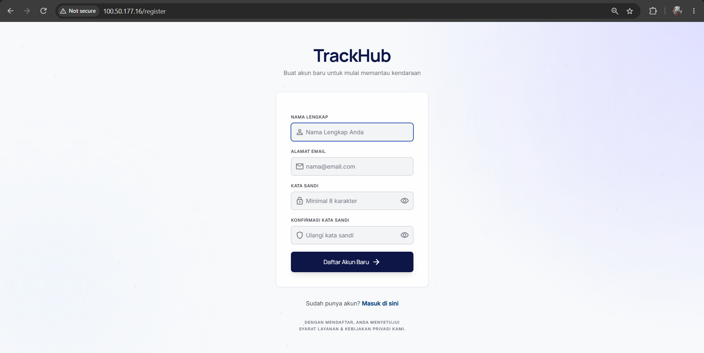
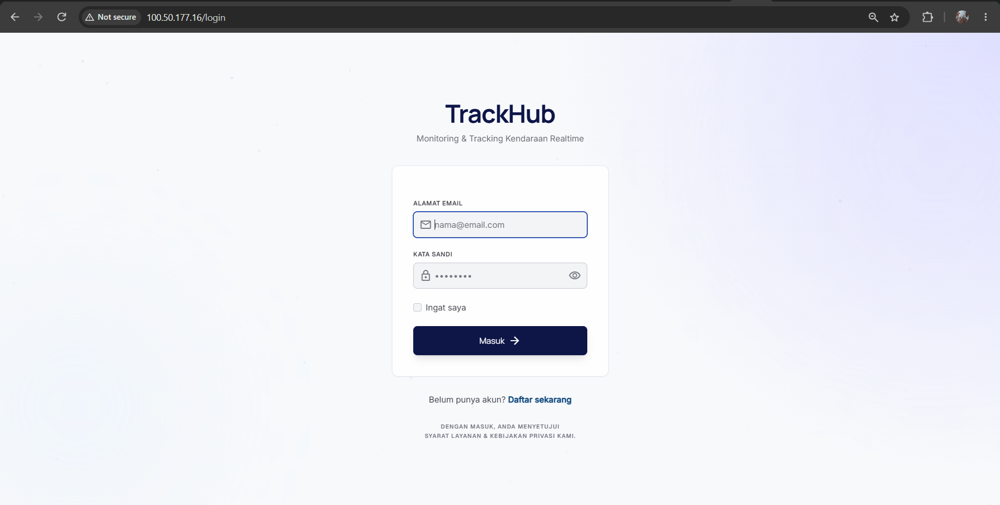
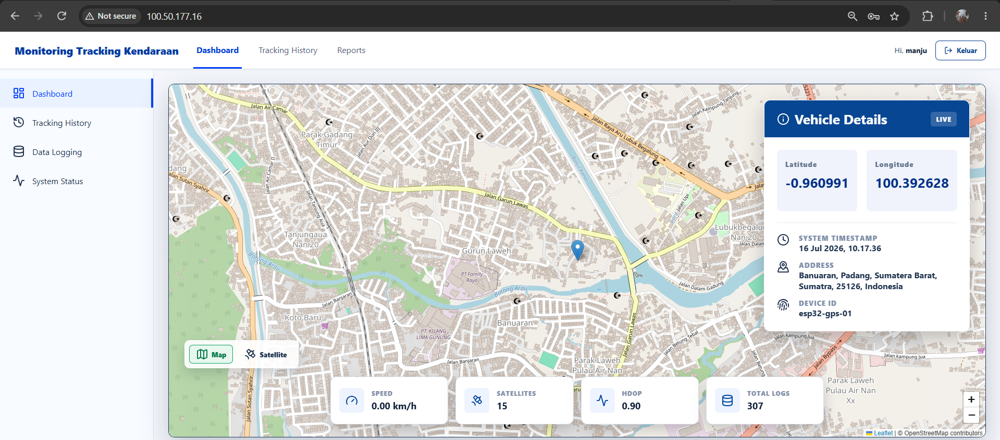
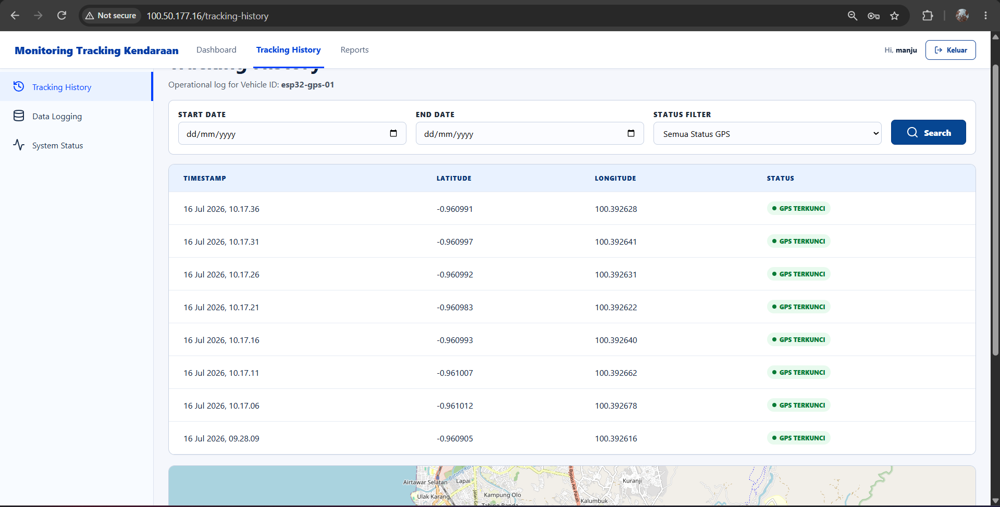
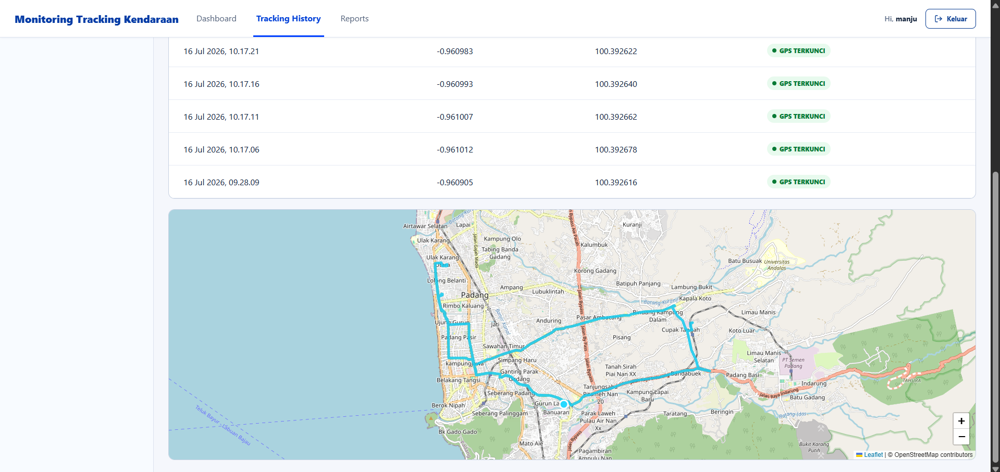
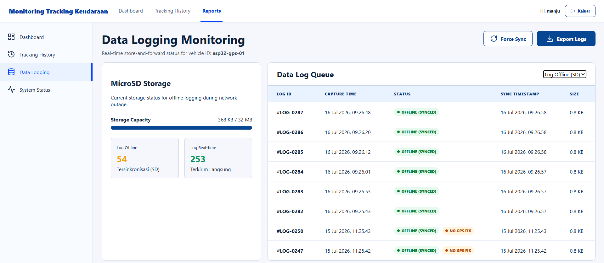
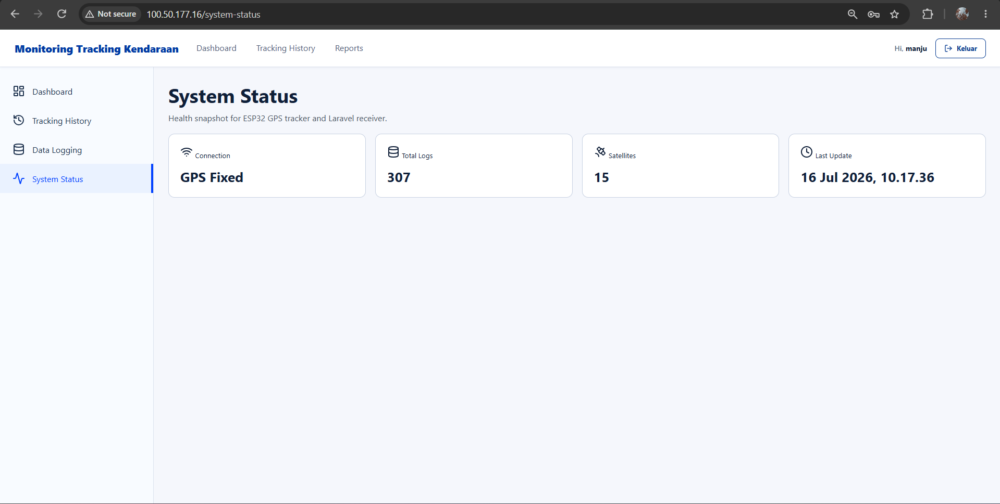

# 📡 Sistem Pelacakan Kendaraan IoT (IoT Vehicle Tracking System)

[](https://laravel.com)
[](https://www.docker.com)
[](https://aws.amazon.com)
[](https://mqtt.org)
[](https://www.espressif.com)

Solusi pelacakan kendaraan berbasis IoT (Internet of Things) yang tangguh dan menyeluruh. Sistem ini menggunakan **mikrokontroler ESP32** yang terintegrasi dengan **modul GPS Neo-M8N** untuk menangkap koordinat lokasi secara real-time. Data lokasi kemudian dikirim menggunakan protokol **MQTT** ke broker **Eclipse Mosquitto**, lalu diproses oleh sistem background listener di **backend Laravel**, dan divisualisasikan pada dashboard web interaktif. Seluruh aplikasi telah dikontainerisasi menggunakan **Docker** sehingga siap untuk di-deploy ke cloud **AWS EC2**.

---

## 🗺️ Arsitektur Sistem

```mermaid
graph TD
    subgraph Hardware [Perangkat Keras IoT]
        NeoGPS[Neo-M8N GPS Module] -->|NMEA Sentences / Serial| ESP32[ESP32 MCU]
        SDCard[SD Card Reader] <-->|Offline Buffer / SPI| ESP32
    end

    subgraph AWS [AWS EC2 Cloud Server / Local Docker]
        MQTT[Mosquitto MQTT Broker:1883] <--|Publish Topic: trackhub/gps| ESP32
        
        subgraph LaravelApp [Ekosistem Laravel & Docker]
            Listener[Artisan Command: mqtt:listen] -->|Subscribes to Broker| MQTT
            Listener -->|Validate & Save| MySQL[MySQL DB:3306]
            
            WebUI[Laravel Web App:8000] -->|Read coordinates| MySQL
            Nginx[Nginx Reverse Proxy:80] -->|Forward requests| WebUI
        end
        
        PMA[phpMyAdmin:8080] -->|DB Management UI| MySQL
    end

    User((User / Browser)) -->|Access Dashboard| Nginx
```

---

## 📸 Tangkapan Layar (Screenshots)

<p align="center">
  
  
  
  
  
  
  
</p>

---

## ✨ Fitur Utama

- **Pelacakan GPS Real-Time**: Pelacakan dengan presisi tinggi menggunakan pustaka TinyGPS++ untuk parsing data NMEA dari modul GPS.
- **Penyimpanan Offline & Sinkronisasi Otomatis**: Ketika koneksi WiFi atau MQTT terputus, ESP32 akan otomatis menyimpan data koordinat ke dalam memori Micro SD Card (file `gps_queue.json`). Setelah koneksi kembali terhubung, data antrean tersebut akan dikirimkan kembali secara berurutan agar tidak ada data pelacakan yang hilang.
- **Klien MQTT PHP Mandiri**: Menggunakan implementasi klien MQTT berbasis socket PHP (`SimpleMqttClient`) yang ringan dan dibuat sendiri, sehingga tidak membutuhkan library composer pihak ketiga yang berat.
- **Artisan Daemon Listener**: Worker latar belakang persistensi (`php artisan mqtt:listen`) yang berjalan terus-menerus untuk menerima payload dari broker MQTT, memvalidasi data koordinat, dan menyimpannya ke database MySQL.
- **Arsitektur Berbasis Docker**: Mempermudah setup lingkungan pengembangan dengan kontainerisasi Laravel, Nginx, MySQL, phpMyAdmin, dan Eclipse Mosquitto.
- **Dashboard Web Interaktif**: Dilengkapi dengan sistem registrasi & login user, peta pemantau lokasi langsung (live map), pelacak riwayat rute, ekspor data logging, serta monitoring status kesehatan sistem.

---

## 🔌 Rangkaian Perangkat Keras & Pinout

### 1. Koneksi ESP32 ke GPS Neo-M8N
| Pin Neo-M8N | Pin ESP32 | Keterangan |
| :--- | :--- | :--- |
| **VCC** | 3.3V / 5V | Input Daya (Power) |
| **GND** | GND | Ground |
| **TX** | GPIO 16 (RX2) | Transmisi data dari GPS ke ESP32 |
| **RX** | GPIO 17 (TX2) | Penerimaan data dari ESP32 ke GPS |

### 2. Koneksi ESP32 ke Modul Micro SD Card (SPI)
| Pin SD Card | Pin ESP32 | Keterangan |
| :--- | :--- | :--- |
| **VCC** | 5V / 3.3V | Input Daya (Power) |
| **GND** | GND | Ground |
| **MISO** | GPIO 19 | Master In Slave Out |
| **MOSI** | GPIO 23 | Master Out Slave In |
| **SCK** | GPIO 18 | Serial Clock |
| **CS** | GPIO 5 | Chip Select (Bisa diatur di kode) |

---

## 🚀 Instalasi & Konfigurasi Lokal

Anda dapat menjalankan proyek ini di komputer lokal dengan dua cara: menggunakan **Docker Compose** (sangat disarankan) atau **secara manual**.

### Metode A: Menggunakan Docker Compose (Paling Cepat)

1. Pastikan **Docker** dan **Docker Compose** sudah terpasang di komputer Anda.
2. Clone repositori ini dan buka foldernya:
   ```bash
   git clone <url-repositori-anda>
   cd gpstracker
   ```
3. Salin file konfigurasi environment di dalam folder `trackhub`:
   ```bash
   cp trackhub/.env.example trackhub/.env
   ```
   *(Catatan: File `.env.example` bawaan sudah dikonfigurasi untuk menghubungkan database ke service `db` dan MQTT ke service `mqtt` di dalam Docker).*
4. Jalankan seluruh layanan Docker:
   ```bash
   docker compose up -d
   ```
   Perintah ini akan menyalakan secara otomatis:
   - **Aplikasi Laravel** (`localhost:8000`)
   - **Nginx Web Server** (`localhost:80` - meneruskan permintaan ke Laravel)
   - **MySQL Database** (Port `3306`)
   - **phpMyAdmin** (`localhost:8080`)
   - **Mosquitto MQTT Broker** (Port `1883`)
   - **Laravel MQTT Listener Daemon** (Subcribe data di latar belakang)

5. Jalankan migrasi database di dalam kontainer Laravel:
   ```bash
   docker compose exec app php artisan migrate
   ```

---

### Metode B: Instalasi Manual (Tanpa Docker)

Jika Anda ingin menjalankan komponen backend secara terpisah satu per satu di komputer lokal Anda:

#### 1. Jalankan MQTT Broker
Unduh dan pasang [Eclipse Mosquitto](https://mosquitto.org/download/). Jalankan broker secara lokal menggunakan file konfigurasi Anda:
```bash
mosquitto.exe -c ./MQTT/mosquitto-local.conf -v
```

#### 2. Buat Database
Nyalakan server MySQL lokal Anda dan buat database baru bernama `gpsdb`.

#### 3. Jalankan Server Laravel
1. Masuk ke direktori Laravel:
   ```bash
   cd trackhub
   ```
2. Instal dependensi PHP menggunakan Composer:
   ```bash
   composer install
   ```
3. Salin dan sesuaikan isi file `.env`:
   ```bash
   cp .env.example .env
   # Update nilai DB_HOST, DB_PASSWORD, dan MQTT_HOST (sesuaikan dengan IP broker lokal Anda)
   ```
4. Buat kunci aplikasi (Application Key) dan jalankan migrasi database:
   ```bash
   php artisan key:generate
   php artisan migrate
   ```
5. Instal dependensi frontend dan bangun aset:
   ```bash
   npm install
   npm run dev
   ```
6. Jalankan server lokal Laravel:
   ```bash
   php artisan serve --host=0.0.0.0 --port=8000
   ```

#### 4. Jalankan Command MQTT Subscriber
Buka terminal baru, lalu jalankan daemon listener untuk menerima koordinat GPS yang masuk:
```bash
cd trackhub
php artisan mqtt:listen
```

---

## 🛠 / Konfigurasi Arduino ESP32

1. Buka aplikasi **Arduino IDE**.
2. Instal pustaka (libraries) berikut melalui Library Manager:
   - `WiFiManager` (oleh tzapu)
   - `PubSubClient` (oleh Nick O'Leary)
   - `TinyGPSPlus` (oleh Mikal Hart)
   - `SD` (bawaan)
   - `SPI` (bawaan)
3. Buka file sketsa `kodeArduino/kode/kode.ino`.
4. Sesuaikan konfigurasi IP server Anda di dalam kode tersebut:
   ```cpp
   const char* mqttBroker = "IP_BROKER_ANDA"; // Ganti dengan IP komputer lokal Anda atau IP Publik AWS EC2 Anda
   const uint16_t mqttPort = 1883;
   const char* mqttTopic = "trackhub/gps";
   ```
5. Unggah (upload) program tersebut ke papan ESP32 Anda.
6. Gunakan fitur **WiFiManager** untuk menghubungkan ESP32 ke jaringan WiFi lokal Anda (ESP32 akan membuat Access Point bernama `ESP32-GPS-Tracker` saat pertama kali dinyalakan agar Anda bisa login dan mengisi nama serta password WiFi rumah/lokasi Anda).

---

## ☁️ Deployment ke AWS EC2 (Menggunakan Docker)

1. **Jalankan Instance EC2 baru** (Disarankan menggunakan Ubuntu 22.04 LTS).
2. **Atur Security Groups di AWS Console**:
   - Buka Port `80` (HTTP) & `443` (HTTPS)
   - Buka Port `22` (SSH)
   - Buka Port `1883` (Akses Broker MQTT dari modul ESP32)
   - Buka Port `8080` (Opsional - phpMyAdmin, sebaiknya batasi hanya untuk IP Anda saja demi keamanan)
3. **Instal Docker dan Docker Compose** pada server EC2 Ubuntu tersebut.
4. Clone kode proyek Anda ke dalam server:
   ```bash
   git clone <url-repositori-anda> /var/www/gpstracker
   cd /var/www/gpstracker
   ```
5. Konfigurasi file `.env` di dalam folder `trackhub/`, pastikan untuk mengatur `APP_ENV=production` dan `APP_DEBUG=false`.
6. Bangun dan jalankan kontainer Docker:
   ```bash
   docker compose -f docker-compose.yml up -d --build
   ```
7. Jalankan migrasi database di server produksi:
   ```bash
   docker compose exec app php artisan migrate --force
   ```
8. Perbarui variabel `mqttBroker` di dalam program ESP32 Anda menggunakan **IP Publik AWS EC2** Anda, lalu unggah kembali program tersebut ke ESP32.

---

## 📊 Format Data Payload MQTT

ESP32 mengirimkan data lokasi berupa string JSON ke topik `trackhub/gps`.

**Contoh Payload JSON:**
```json
{
  "device_id": "esp32-gps-01",
  "latitude": -6.2088,
  "longitude": 106.8456,
  "altitude_m": 12.5,
  "speed_kmph": 45.2,
  "satellites": 8,
  "hdop": 1.2,
  "raw_nmea": "$GPRMC,070007.00,A,0612.5280,S,10650.7360,E,0.22,120.4,170726,,,A*6D",
  "recorded_at": "2026-07-17 14:00:00",
  "offline": false
}
```

---

## 📁 Struktur Repositori

```text
gpstracker/
├── MQTT/                           # Konfigurasi dan logs Mosquitto Broker
│   ├── mosquitto-docker.conf       # Config yang digunakan di Docker
│   ├── mosquitto-local.conf        # Config untuk uji coba lokal (non-docker)
│   └── logs/                       # Log aktivitas Mosquitto server
├── kodeArduino/
│   └── kode/
│       └── kode.ino                # Sketsa Arduino ESP32 untuk pembacaan & sinkronisasi
├── nginx/
│   └── conf.d/
│       └── default.conf            # Konfigurasi reverse proxy Nginx
├── trackhub/                       # Folder Utama Aplikasi Laravel
│   ├── app/                        # Services aplikasi & Klien MQTT kustom
│   ├── config/                     # Konfigurasi Laravel
│   ├── database/                   # Migrasi database dan seeders
│   ├── routes/
│   │   ├── web.php                 # Rute antarmuka Web Dashboard
│   │   └── console.php             # Rute daemon listener MQTT latar belakang
│   ├── Dockerfile                  # Konfigurasi build container php/nginx
│   ├── .env.example                # Contoh konfigurasi environment
│   └── composer.json               # Dependensi PHP Laravel
├── docker-compose.yml              # Konfigurasi orkestrasi seluruh layanan Docker
└── README.md                       # Dokumentasi proyek (File ini)
```

---

## 🤝 Kontribusi
Kontribusi, laporan bug/isu, dan saran fitur baru sangat diterima. Silakan buat *Pull Request* atau ajukan *Issue* di repositori ini.

## 📄 Lisensi
Proyek ini dilisensikan di bawah [MIT License](LICENSE).
